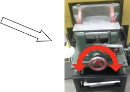

*****
Jaw Crusher
*****

*It is recommended to complete preliminary cleaning and set up for both the jaw crusher and the disc mill, then run your sample through both, in that order.*

1. Clean the jaw crusher plates by first scrubbing thoroughly with the metal brush, followed by vacuuming, blowing with compressed air, then wiping with a slightly damp paper towel. (Be sure to dry the jaw crusher with compressed air immediately after using damp paper towel to prevent build up of rust). Remember to clean spaces around the plates, and all surfaces of the machine that may have gathered dust as well. Close the jaw crusher and tighten the wheel to hold it in place.

.. figure:: ../images/jawCrusher_1.png
   :alt: Image of Jaw crusher
   :align: center

   Image of Jaw Crusher (caption)

1. Clean the sample collection tray below the jaw crusher with the vacuum, compressed air, and damp paper towel as necessary until it is thoroughly free of dust or possible contaminants. (Be sure to dry it thoroughly so dust doesn’t stick to it later).
2. Make sure your sample is in pieces small enough to fit in the jaw crusher, and if it is not, wrap it in newspaper and take it outside to the loading dock with a sledge to break it into small enough pieces, being careful not to contaminate it with the asphalt outside.
3. Adjust the opening between the jaw crusher plates until the gap is about 0.5 cm across (to yield pieces that are approximately pea-sized).

1. DON PROTECTIVE GEAR: Safety glasses and dust mask. Hearing protection too, if desired.
2. Run your sample through the jaw crusher by dropping in a handful of your sample at a time, and immediately covering with the metal plate to prevent pieces from flying all over the room. (Keep your hand on the plate while it’s covering the opening. Harder rocks will fly upward with some force). Wait for the jaws to clear completely, and then deposit the next handful.
3. Once all of your sample is processed, remove the sample collection tray, and move it to the table (which should be wiped down with a damp paper towel before-hand).

**If you will be performing geochemistry: Fill a plastic cup about 2/3 full with pea-sized pieces of your sample and put a lid on the cup. Save this for geochem processing.**

1. Either move the remaining sample in the tray to the disc mill, or secure it in such a way that it will not be contaminated until you return. Once you are done with everything, VERY thoroughly clean the jaw crusher using the methods in step 1. The equipment should be cleaned before and after use, even if you were the last to use it.
2. High-five yourself.
