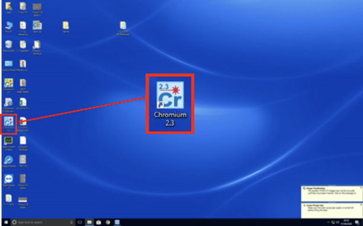
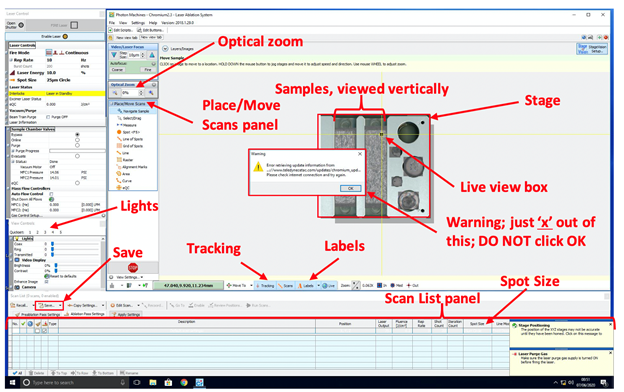
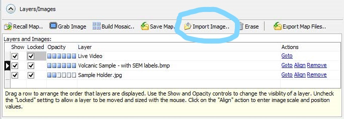
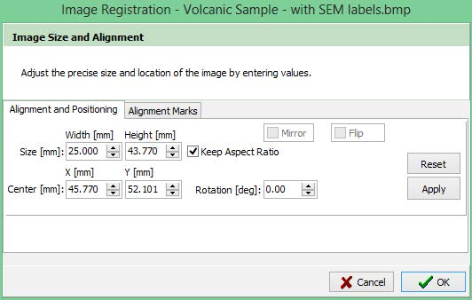
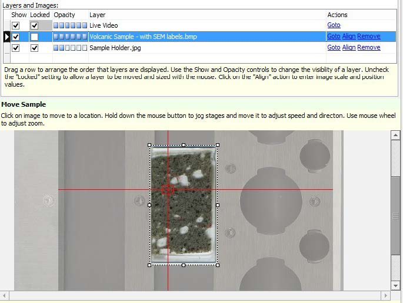

Laser Ablation System - Sample Navigation & Georectification
#############################################################

Introduction
*************
This document serves as a guide to georectification and low-zoom optical sample navigation on the Thermo-Fisher Scientific Element2 Laser Ablation system in the PLASMA lab at California State University, Northridge.

.. contents:: Table of contents

Georectification
*****************
This section will guide you through georectification of an existing image (optical, CL, etc) in the Chromium2.3 Laser Ablation software.

.. Note:: More coming soon!

Requirements
=============

.. Note:: In order to successfully georectify an optical image on the laser, it is imperative that it does not already contain any significant dimensional distortion from a stitching process. For this reason, images from the SEM or Nikon petrographic microscope are ideal.

#. Well-lit plane-polarized light (PPL) image of the prepared thin-section.

#. Sample map with grain locations noted.

Loading Images
===============

#. First, open the Chromium2.3 program from the laser control computer.

#. Choose "Import Image.." from the **Layers** tab at the top-center of the screen.

.. Attention::
  Chromium2.3 only supports the import of the following file types: BMP, JPEG, PNG, TIFF

#. The pop-up box will ask you to enter the image size and alignment manually, but we're not really going to worry about this for now. If you know the size of your thin-section in mm, you can enter it here, otherwise just click **Ok**.

#. At this point, the pop-up dialog will close and your image will be loaded onto the main screen. Make certain that the "Locked" box is unchecked like in the image below.

Continue onto the next section for a walkthrough of the image alignment process.

Image Alignment
================
