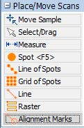
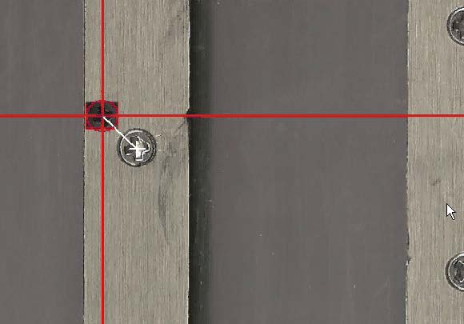
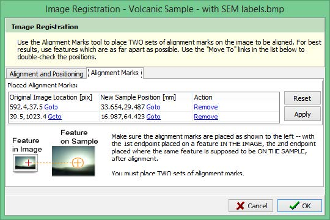

Laser Ablation System - Sample Navigation & Georectification
#############################################################

Introduction
*************
This document serves as a guide to georectification and low-zoom optical sample navigation on the Thermo-Fisher Scientific Element2 Laser Ablation system in the PLASMA lab at California State University, Northridge for the purposes of identifying mineral grains for analysis.

Depending upon the characteristics of your sample, one method may be preferred over the other. Samples that have easily visible and differentiable mineral grains in plane-polarized or reflected light will benefit most from the low-optical zoom method as it creates a significant time savings over other methods of grain identification.

.. contents:: Table of contents

Georectification
*****************
This section will guide you through georectification of an existing image (optical, CL, etc) in the Chromium2.3 Laser Ablation software.

.. Note:: More coming soon!

Requirements
=============

.. Note:: In order to successfully georectify an optical image on the laser, it is imperative that it does not already contain any significant dimensional distortion from a stitching process. For this reason, images from the SEM or Nikon petrographic microscope are ideal.

#. Well-lit plane-polarized light (PPL) image of the prepared thin-section.

#. Sample map with grain locations noted.

Loading Images
===============

#. First, open the Chromium2.3 program from the laser control computer.

#. Choose "Import Image.." from the **Layers** tab at the top-center of the screen.

.. image:: ../images/ChromiumLayers_import.jpg
  :alt: Labeled image of Chromium2.3 software.
  :align: center

.. Attention::
  Chromium2.3 only supports the import of the following file types: BMP, JPEG, PNG, TIFF

#. The pop-up box will ask you to enter the image size and alignment manually, but we're not really going to worry about this for now. If you know the size of your thin-section in mm, you can enter it here, otherwise just click **Ok**.

#. At this point, the pop-up dialog will close and your image will be loaded onto the main screen. Make certain that the "Locked" box is unchecked like in the image below.

.. image:: ../images/Unlock.jpg
  :alt: Labeled image of Chromium2.3 software.
  :align: center

Continue onto the next section for a walkthrough of the image alignment process.

Image Alignment
================
.. Note:: More coming soon!

Now that your optical image has been loaded into Chromium2 we will use the "Alignment Marks" tool to match features between our image and the Live View of the sample.

#. The first step in the image alignment process is locating a recognizable feature on both representations of your sample.
  #. Find a unique mineral grain or other sample feature (good choices include multiple grain intersections and other point-like features) on your imported image.
  #. Locate this same feature in the Live View window. You may have to zoom in and/or adjust the lighting.

.. Tip:: If your imported image is in the way of the Live View, turning its opacity down and using the "Select/Drag" tool to offset it from the true position may make this process easier.

#. Click on the "Alignment Mark" tool in the Chromium2 toolbar.

#. With the Alignment Mark tool selected click on the feature on your **imported image**, then click on the same spot in the Live View to place two alignment marks.

.. Note:: You can use the "Select/Drag" tool to reposition the marks you have made if they are not exactly in the right place. The more precise the alignment marks are, the better the results will be.

#. Now, zoom out and find second feature to align. This should ideally be as far away from your first point as possible.

#. Repeat steps 2 & 3 above to place alignment marks on this new feature.

#. Double check to make sure your alignment marks are placed in exactly the same location on each feature.

#. In the "Layers and Images" bar at the top of the Chromium2 screen, click "Align" next to your imported image. This will open a window showing the locations of your alignment marks.

#. If your alignment marks were placed properly, the program will now automatically georecitify the imported image to the Live View! If this process succeeds, move on to collecting your data. 'This guide <https://docs.google.com/document/d/1YPAfG0GlW_42YNG_G1rbqmAK5pojShTGBN7mSOoytZc/edit>`_ has a detailed walkthrough of selecting individual spots.

.. Attention:: If you are unsuccessful at the automatic georectification process, try repeating the steps outlined above with an extra set of alignment marks. If this does not work, use the instructions described in :ref:'Low-Zoom Orientation, Navigation, and Single-Mineral Mosaics'

Low-Optical Zoom Orientation & Navigation
*******************************************
This section of the guide details a process that combines low-optical zoom navigation of the sample holder in with the creation of small reflected light mosaic images of the target grains.

Requirements
=============

#. Well-lit PPL image with recognizable and notated mineral grains for use as a map. A digital image on a laptop or tablet is ideal.

.. Tip:: Take note of the shape of the edges of your sample, a thorough understanding of its orientation in the sample holder will speed this process up significantly.

Low-Zoom Orientation, Navigation, and Single-Mineral Mosaics
=============================================================

#. After achieving ideal "Live View" lighting on your sample (covered in `this guide <https://docs.google.com/document/d/1YPAfG0GlW_42YNG_G1rbqmAK5pojShTGBN7mSOoytZc/edit>`_), reduce the Optical Zoom to 35%.

Zooming out will allow you to recognize grain shapes from your labeled PPL map as they should now appear to be a similar scale. Using a digital image on a tablet or laptop will be easier than a printed map for this stage, as you will be able to modify the zoom of the PPL image to closer match the Live View of the laser.

#. Using your map and knowledge of the sample's orientation in the laser cell, find an identifiable feature along one edge or corner of the sample.

.. Tip:: You may have to adjust the lighting somewhat at this lower zoom for a clear image. Try the presets first, usually, number **3** or **4** will work well without modification.

#. Now, using your labeled map, navigate to your chosen grain(s). From the **Layers** menu, choose "Build Mosaic."

#. Draw a box just outside the extent of your chosen grain and click 'OK'. This imaging process should take 30-60 seconds, depending upon the size of your selected mineral grain.

#. Repeat this process for each grain on your sample, and for each sample in the sample holder.

Once you have completed either process detailed above, move on to the `this guide <https://docs.google.com/document/d/1YPAfG0GlW_42YNG_G1rbqmAK5pojShTGBN7mSOoytZc/edit>`_ for a detailed walkthrough of selecting individual spots.
