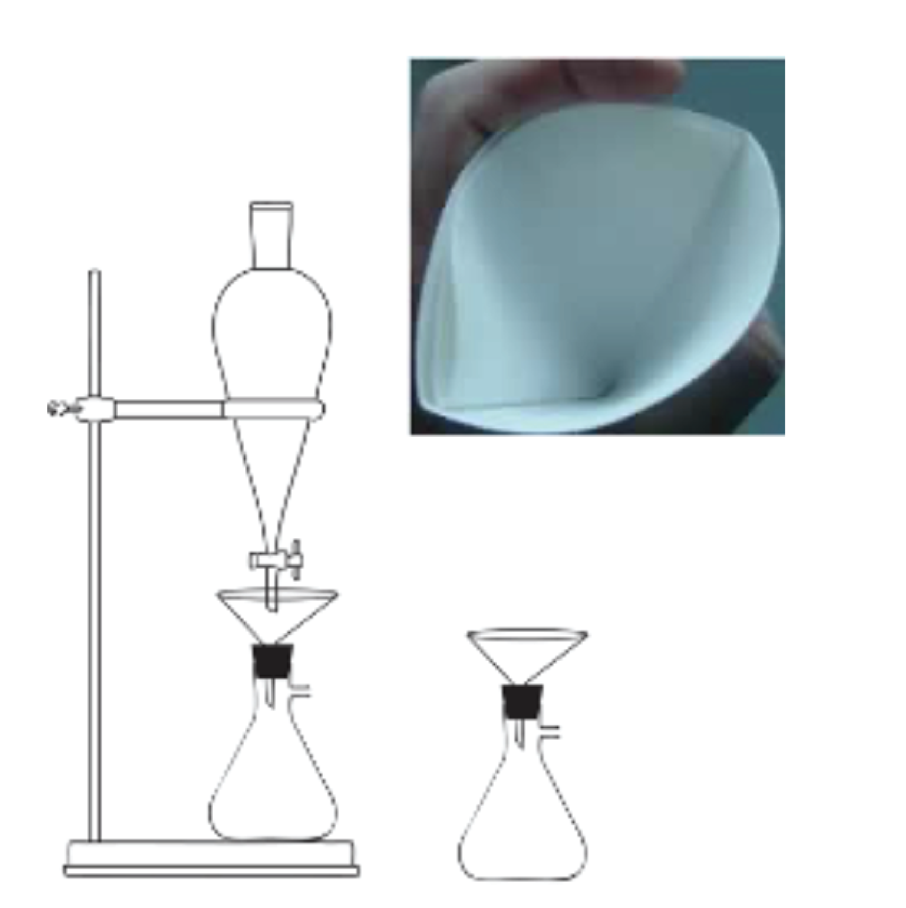

*****
Heavy Liquid Separation
*****

.. DANGER::
  * Methylene iodide (M.I.) is VERY toxic
  * Always perform this procedure under a fume hood, and with the proper safety gear.
  * Any spills or drops of M.I. must be IMMEDIATELY cleanup up using a paper towel dampened with acetone. M.I. will dissolve and become inert in acetone.

.. Note::
  We are relying on the density of the M.I. to separate zircon from the rest of the sample. Therefore, it is very important that you do not accidentally mix anything into the M.I., as we will be reclaiming it and using it over and over again. This also means all glassware must be COMPLETELY DRY before you begin. Keep careful track of what you are doing and WORK SLOWLY. The M.I. is very expensive and we want to avoid having to replace it.

.. Attention::
  Anything that touches M.I. or acetone should be disposed of in a Ziploc bag labeled “M.I. Waste” kept under the hood to be collected later on by someone certified to dispose of chemical waste. This includes filters, paper towels, kimwipes, latex gloves, etc…

.. contents:: Table of contents

Set Up
=====

#. Put on latex gloves and a lab coat.
#. Gather the following supplies:

  * Two (2) vacuum Erlenmeyer flasks
  * Two (2) glass funnels with rubber stoppers
  * One (1) 250 or 500 mL separatory funnel and stopcock assembly
  * Separatory funnel stand.
  * Two (2) pieces of circular filter paper
  * One (1) glass stirring rod

#. Arrange the supplies as shown in the diagram below.

#. Take a piece of circular filter paper, and fold it in half, then in half again. Open it (2) and crease the sides. Place it in one of the glass funnels so that it stays. Repeat with another piece of filter paper for the second funnel.

#. Place a paper towel down under the fume hood, and place a full bottle of acetone in a squirt bottle on this towel. Place another paper towel down and place a stirring rod on this towel.

Processing Your Sample
=====

#. Ensure that the stopcock is in the closed position — the handle should be horizontal — and CAREFULLY pour M.I. into the top of the separatory funnel. It should be filled up to just above the ring of the stand. (More M.I. will be needed for larger samples).

#. Pour your sample into the top of the separatory funnel. You may want to pour it onto weighing paper first, then it into a “V” shape and use this to pour it in.

#. Agitate the sample with the stirring rod. You should be quite vigorous, and make sure to get the rod all the way down to the stopcock and agitate the sample that has sunk to the bottom as well. Use the rod to get any sample off that has stuck to the sides of the separatory funnel. The point here is to free the grains from each other so that the zircon will sink and the lighter minerals will rise, so be sure you agitate the sample thoroughly.

#. Wait about 5 minutes, and then repeat the agitation. Perform 3 total agitations.

#. After the last agitation, wait another five minutes, and then turn the stopcock 180°. This should be done relatively quickly. If you allow too much M.I. to fall through, you will be including more apatite in your sample. Apatite closely matches the density of M.I., so it will be floating in it. Allow the M.I. to flow through the filter paper until it stops dripping. Raise the separatory funnel so it is out of the way. Once it stops dripping, leave the flasks in place, but switch the glass funnels.

#. Lower the separatory funnel into place again. Open the stopcock to allow a slow trickle of M.I. into the new, clean filtered funnel. It should be draining into the same flask that already has some M.I. in it. Allow the separatory funnel to empty completely.

#. Rinse the sample on the other flask, away from the separatory funnel with acetone thoroughly. Make sure to squirt down into the sample to move the grains around, and rinse all parts of the filter paper. Wait until acetone drains, and repeat about 3 or 4 times, or until you are confident you’ve rinsed and dissolved all the M.I.

#. Remove the filter paper from the funnel that has just been rinsed, and place the filter paper under a heat lamp, opened, so that the sample can dry.

#. Move the empty glass funnel to the sink and place in a bin with warm, soapy water.

Clean Up
=====

#. Once again, raise the separatory funnel out of the way. This time, switch the flasks, but leave the same funnel under the separatory funnel. Lower the separatory funnel again.
#. Immediately pour the reclaimed M.I. back into the M.I. bottle and put it away.
#. Breathe a sigh of relief.
#. Rinse the empty flask that just had M.I. in it with acetone, and pour the M.I. & acetone mixture into the collection bottle labeled “M.I. & acetone”.  Move the flask to the soapy bin.
#. Rinse the inside of the separatory funnel very thoroughly with acetone, and be sure to get any sample stuck to the sides. Loosen the stopcock and turn it as the acetone drains to rinse it as well. Once you are satisfied that there is no more M.I. on the separatory funnel or the stopcock, move them to the soapy bin.
#. Rinse the sample that was drained from the separatory funnel in the same way you rinsed the other portion of sample (step 10).
#. Rinse the stirring rod with acetone over the funnel with sample in it to remove any beads of M.I.
#. By now the first filter paper should be dry. Label a Petri dish with your sample name, and “heavy <250μm Fr. 1.5 amp non-mag M.I. ↓”. Place the Petri dish on a piece of weighing paper to catch any sample that misses the dish. Carefully pinch one corner of the filter paper and pour the sample through the small opening you’ve created into the Petri dish. There will be a very small amount of sample, so be careful it doesn’t blow away or miss the Petri dish. Rub the two sides of the filter paper together to free any sample that may be left on the paper. Immediately seal the Petri dish and place it aside.
#. Let the M.I. ↑ portion of your sample dry under the heat lamp.
#. Pour any remaining M.I. and acetone mixture into the collection bottle, and move all remaining glassware to the soapy bin.
#. Once the M.I.↑ portion of the sample is dry, pour it back into the glass “non-mag” vial. Add the label “M.I.↑” to the vial.
#. Dispose of all paper towels, funnels, and your latex gloves into the “M.I. waste” collection bag.
#. Rinse off all glassware and leave it on the drying rack.
#. High-five yourself.
